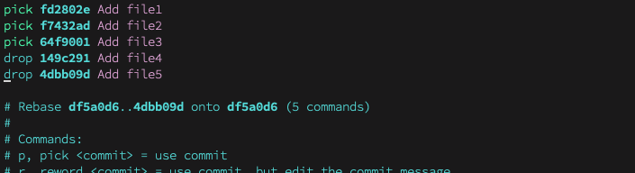
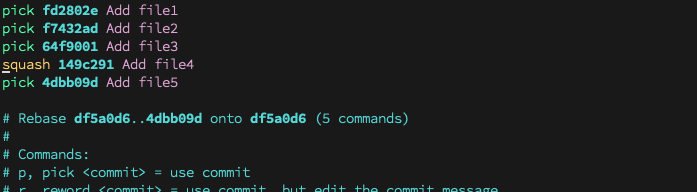

[Git rebase](https://git-scm.com/docs/git-rebase) is a powerful command that lets us reapply commits on top of another commit or branch. It is a very useful command for both collaborating with others and developing our own project. As a developer myself, I experienced the situation that forgetting to commit in a minimum size when I was working in a flow. Besides, sometimes I wrote unreadable commit messages just because I wanted to try some thoughts out rapidly.

We all know it is a good practice to make commits reasonable size and readable no matter for code review or for future reference. As a result, rebasing could be a final step before sending a merge request. I am sharing some manipulations that I often apply in my daily work.

## Overview of Interactive Mode
Here is a [demo repo](https://github.com/adelinewei/git-rebase-demo) created for demo purpose. You can clone it and try it out by yourself for a better understanding.
The demo repo contains six commits, including an initial commit and five commits adding file 1, file 2, ..., file 5 in order. The original git graph looks like this: 
We would like to rebase based on the initial commit in interactive mode, so we can write down `git rebase -i df5a0d6`.

As you can see in the interactive mode, it shows commit history. The earliest commit is on the top, and the latest commit is at the bottom of the view. Below the commit history, it comes explanation of commands that can be used along with rebasing.

Today, we are going to talk about how to "reorder", "reword", "delete" and "squash" commits.  

## Usage of Commands
### Reorder commits

Let's try to move "Add file2" after "Add file5".  
In this view, just simply cut the line of commit "Add file2" and paste it above "Add file5" since we mentioned that the upper commit the newer commit. Then, save this change and exit the view, by doing "esc :wq" since I am using a vim editor.

*TODO: Get a small commit history after the change applied.*

### Reword commits

We change from "pick" to "reword". It shows up this view when you save and exit current view.  

### Delete commits

Here we will see two cases. The first one we are deleting the last two commits. Now the main tag is pointing to xxx, and the ORIG_HEAD is pointing to the last commit from the previous status. The second case is demonstrating the case when we delete "Add file3" and "Add file4". There will be new commits generated.

### Squash commits

We are going to combine/merge two or more commits together.

## Epilogue
Although we were manipulating on main branch, this is just a demonstration. Please remember that never modify public history. Do rebasing on your own branch, and merge it to main branch. Hope you find something interesting, don't hesitation to give me any feedback.