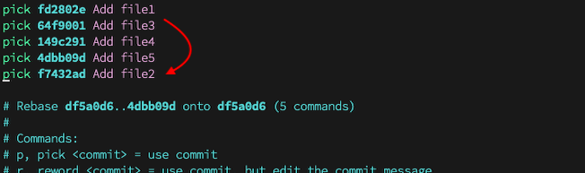
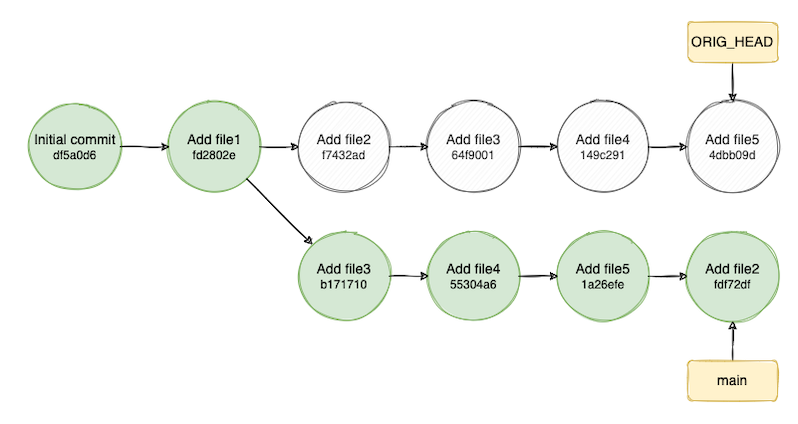
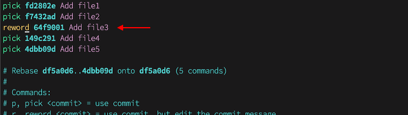
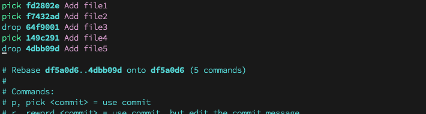

[Git rebase](https://git-scm.com/docs/git-rebase) is a powerful command that lets us reapply commits on top of another commit or branch. It is a very useful command for both collaborating with others and developing our own project. We all know it is a good practice to keep a commit within reasonable size and readable for either code review or for later reference. However, as a developer myself, I often make mistakes when I am too focus on the coding flow to pay attention to follow displine.

Therefore, I would like to share with you some git rebase commands that I use everyday to keep my code away from chaos.

## Demostration and Explanation
### A Quick View on the Demo Material
Here is a [demo repo](https://github.com/adelinewei/git-rebase-demo) created for the demo purpose. You can clone it and try it out by yourself for a better understanding.

The demo repo is consisted of five files (file 1, file 2, ... file 5), pushed one by one in order.

Git history visualization of the demo repo:

Today, I am going to share how to `reorder`, `reword`, `delete` and `squash` commits.

### Interactive Mode GUI
To start interactive rebasing, run this command `git rebase -i df5a0d6`.

`git rebase -i [commit|branch]` \
-i, --interactive: let the user edit the list of commits to rebase \
[commit|branch]: the base commit or branch to reapply on


The picture above shows the information we will see when entering interactive mode.

{{< style "strong{color:#FF0000;}" >}} Information inside **red** rectangle indicates the commits history. The top line is the earliest commit, and the line at bottom is the latest commit. 

{{< style "strong{color:#0000FF;}" >}} Text inside **blue** rectangle usually contains the explanation of commands or the status of rebasing. Text is commented out, which means the result of rebasing will not be affected by the content.  

## Command Usages
### Reorder commits

This example is to move commit `Add file2` after `Add file5`. We can achieve that by,
1. Simply cut the line of commit `Add file2` and paste it below commit `Add file5`,
2. Save the change and exit the view

Above one-line log shows the reapplied commit history. Now `Add file2` becomes the newest commit.

*TODO: Correct commit hash*

From the git visualization above, we found that there is no commit being removed. Instead, a new path with a couple of new commits has been generated. A tag **main** is pointing to the latest commit of the new path, which is `Add file2`. Another tag **ORIG_HEAD** is pointing to the previous status, so we can reset to the previous status anytime by running `git reset --hard ORIG_HEAD`.


**Save and exit a file** \
`esc` + `:wq` for editors such as Vi or Vim \
`ctrl` + `x` + `Enter` for editor such as nano

### Reword commits
This example is to reword the message of commit `Add file3` to `Edit file3`. In order to achieve that,

1.Replace command **pick** for the commit to **reword**, save and exit it

2.Unreword message will show up

3.Edit the message to whatever we want (i.e., "Edit file3"), save and exit it

The git visualization above shows that a new path has been created, and the commit message `Edit file3` is included in the new path where tag **main** is pointing to. As we mentioned before, resetting to the previous status is applicable.

### Delete commits
This example is to delete commits in two cases. One is to delete continous last two commits. Another is to delete noncontinous arbitrary commits.

**Case 1: delete continous last two commits** \
Replace **pick** to **drop** for both `Add file4` and `Add file5`, save and exit it.

 \
From the git visualization we can see that tag **main** moved to `Add file3`, which is the latest commits after the deletion. Tag **ORIG_HEAD** is as usual pointing to the previous status.

**Case 2: delete noncontinous arbitrary commits** \
Replace **pick** to **drop** for both `Add file3` and `Add file5`, save and exit it.

 \
From the git visualization we can see that a new path has been created since the deletion is neither applying continous nor the last two commit. The new path contains only four commits sinsce two commits have been removed. Tag **main** is pointing to commit `Add file4` on the new path. Tag **ORIG_HEAD** keeps the previous status by pointing to the latest commit on the original path.

### Squash commits
This example is to merge commits together. The command **squash** will use the applied commit, but meld into the previous commit.

For example, if we replace **pick** with **squash** on commit `Add file4`, the information of commit `Add file4` will be taken care of at the same time when the rebasing arrives the stage where commit `Add file3` is.

1.Replace **pick** with **squash**, save and exit it.

2.1. Keep an explanatory message, save and exit it.

2.2. Or remove unwanted messages and compose a new one.

 \
Git visualization shows that a new path has been created which contains the merged commit `Add file3,4`. Tag **main** is pointing to the new path and tag **ORIG_HEAD** is pointing to the previous status.

## Epilogue
That was basically all I want to share with you regarding the basic rebasing manipulation. Another thing to mention here is that although we manipulate commands on the main branch, it is only for an easier demonstration. Please keep in mind that **never** do it for public history. The good practice would be manipulating within your own branch, and merge it to the main branch.

Hope you find something interesting, and I appreciate all your feedback!